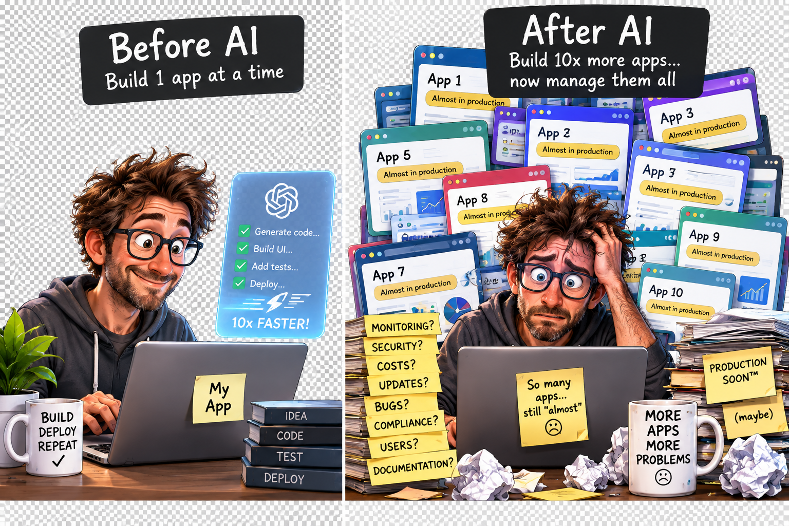
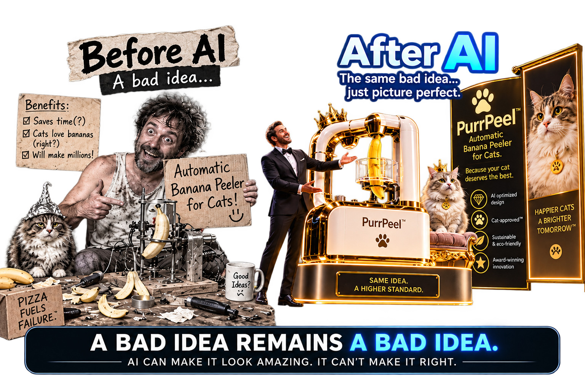

# ai-zone
Thoughts about AI Development

## Is work faster, or do we have more work to manage?

The first week after I drove home from our holiday road-trip, I opened my laptop and  thought, let’s just go ahead and try once more if I can improve my ‘wip’ game I was working on for a long time but couldn’t get to the level I wanted.

It was quite shocking that it took 30 min and the agent working on it did it better than I expected/asked and the result was in essence fully working. I recognized that agents have so much potential, and it just took away all my joy of coding small apps for fun. I shut down my computer and thought- goodbye hobby.

A week later I started accepting the idea, that my new role is product owner, with an intern that does everything I wanted, so I started working on some more ideas in parallel. I whipped up several apps, added level screens, music, even made templates and ci/cd and was feeling like a true leader. 

Now; a few weeks later- I’ve burned a bunch of tokens, have several subscriptions resulting in many potential apps to ship. From experience however, I know that the difficulty is after releasing apps, upgrades, new phone types, overall maintenance becomes trickier over time. 

This made me wonder how to assess when to release and by what standards and it gets quite thought provoking;
- do we make the code easy to read for a human?
- ⁠is our ci/cd process ready to incorporate ai generated code (code complexity/architecture/guardrails defined- in place)?
- ⁠assuming agents will maintain the application, why not just wait with the release until this is possible?

## Is a bad idea not the core problem of a process, what if you're already doing something wrong, will AI fix it?

## Token economics
How is it possible that the shady token economics are accepted. People are going to depend so much on Agents / apps that are updated/created when suddenly the budget is gone, who 
will still have the knowledge to 'complete' a task. Buckle up, half backed software is coming!

### TODO: A person sitting at a desk in the middle of working on a complex project, looking exhausted and frustrated, with visual representations of AI tokens fading away around them, digital rain of code slipping off the screen, and a thought bubble showing 'Out of tokens' - realistic digital art, PNG format
