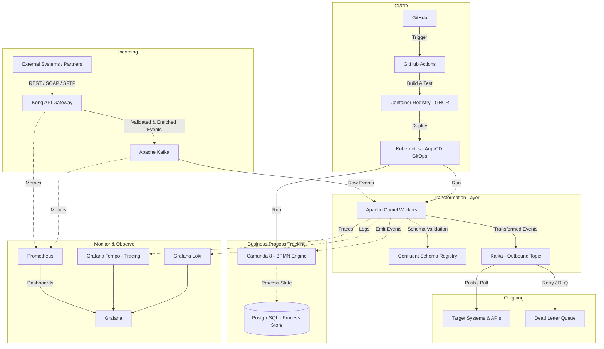

# Enterprise Integration Architecture — Scenario A: No Technical Limitations (Best of Breed)

> **Model:** Claude Sonnet 4.6 | **Domain:** Enterprise Integration | **Scenario:** Technology Agnostic

---

## Design Philosophy

With no constraints, the architecture prioritizes **resilience**, **observability**, and **developer experience** over vendor convenience. Each layer is chosen for being the industry-recognised best-in-class tool for its specific job. Components are loosely coupled via event streaming, enabling independent scaling and deployment.

---

## Architecture Diagram

---

## Component Table

| Component | Usage | Why | Alternatives Considered |
| :--- | :--- | :--- | :--- |
| **Kong API Gateway** | Ingress point for all incoming APIs. Handles auth, rate limiting, and protocol normalisation. | Best-in-class OSS gateway with the widest plugin ecosystem; runs on any infrastructure including bare-metal. | 1. Traefik — simpler but fewer enterprise integration features. 2. Apigee — excellent but GCP-vendor-locked. |
| **Apache Kafka** | Durable, ordered event stream acting as the backbone between all integration layers. | Unmatched throughput, replay capability, and multi-consumer fan-out; the de-facto standard for enterprise event streaming. | 1. RabbitMQ — better for task queues but lacks log compaction and replay. 2. NATS JetStream — lighter-weight and faster, but smaller ecosystem. |
| **Confluent Schema Registry** | Enforces Avro/JSON Schema contracts on all events crossing topic boundaries. | Prevents schema drift in a loosely coupled system; integrates natively with Kafka producers/consumers. | 1. AWS Glue Schema Registry — AWS-specific. 2. Apicurio Registry — solid OSS alternative, slightly less mature. |
| **Apache Camel** | Implements Enterprise Integration Patterns for data transformation, routing, and protocol mediation. | 350+ built-in connectors; EIP patterns are a proven lingua franca for integration engineers. | 1. MuleSoft — premium, far more expensive, commercial lock-in. 2. Spring Integration — lower abstraction level; more boilerplate. |
| **Camunda 8** | BPMN-based business process orchestration and long-running process tracking. | Separates business state from code, enables non-technical stakeholders to read/own workflows; scales horizontally via Zeebe. | 1. Temporal — excellent for code-first orchestration but lacks visual BPMN tooling. 2. Conductor (Netflix) — battle-tested but smaller community. |
| **Grafana OSS Stack** (Prometheus, Loki, Tempo, Grafana) | Full-stack observability: metrics, logs, and distributed traces in a single UI. | Vertically integrated OSS stack with zero per-seat licensing; best-in-class correlation between signals. | 1. Datadog — superb UX but expensive at scale and vendor-locked. 2. Elastic Stack (ELK) — powerful but operationally heavier. |
| **GitHub + GitHub Actions** | Source control, CI pipelines, container publishing, and policy enforcement. | Largest developer community, extensive marketplace actions, and free for OSS workloads. | 1. GitLab — strong all-in-one but self-hosting adds overhead. 2. Buildkite — excellent for large-scale pipelines but requires agent management. |
| **ArgoCD on Kubernetes** | GitOps-based continuous delivery ensuring desired cluster state matches the Git repository. | Declarative, auditable, and self-healing deployments; Kubernetes-native reconciliation loop. | 1. Flux — equally capable but fewer UI features out of the box. 2. Spinnaker — more powerful for multi-cloud but significant operational complexity. |

---

## Key Architectural Decisions

- **Event-first over request-response** — Kafka as the backbone decouples producers from consumers, enabling independent scaling and resilience against downstream outages.
- **Schema enforcement at the border** — Confluent Schema Registry ensures data contracts are explicit and versioned, preventing silent integration failures.
- **GitOps for deployments** — ArgoCD provides a self-healing, audit-friendly delivery mechanism where the Git repository is the single source of truth.
- **Unified observability** — Co-locating metrics, logs, and traces in Grafana enables rapid root-cause analysis without context-switching between tools.

