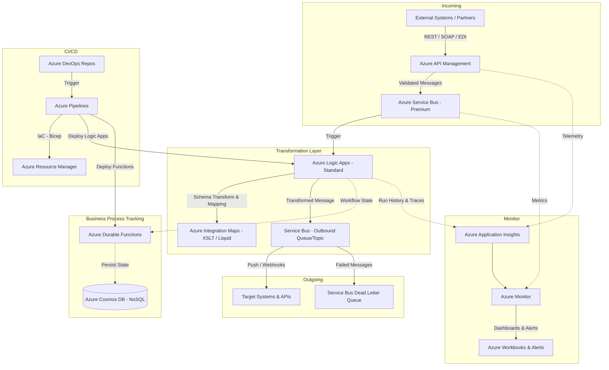

# Enterprise Integration Architecture — Scenario B: Azure Solution Architect

> **Model:** Claude Sonnet 4.6 | **Domain:** Enterprise Integration | **Scenario:** Azure Native

---

## Design Philosophy

As an Azure Solution Architect the goal is to leverage **managed Azure PaaS services** to minimise operational overhead, maximise native integrations, and meet enterprise governance requirements through Azure Policy, RBAC, and Microsoft Entra ID. The design follows the [Azure Integration Services](https://learn.microsoft.com/en-us/azure/architecture/reference-architectures/enterprise-integration/basic-enterprise-integration) reference architecture.

---

## Architecture Diagram

---

## Component Table

| Component | Usage | Why | Alternatives Considered |
| :--- | :--- | :--- | :--- |
| **Azure API Management (APIM)** | Single ingress for all partner and internal APIs. Handles authentication, throttling, IP filtering, and policy enforcement. | Native integration with Entra ID, rich policy language, built-in developer portal, and direct publishing to Azure Service Bus via send-request policies. | 1. Azure Front Door — better suited for global web traffic than API lifecycle management. 2. Kong on AKS — introduces AKS operational overhead unnecessarily in an Azure-native design. |
| **Azure Service Bus (Premium)** | Reliable enterprise message broker for decoupling ingestion from processing; supports sessions, transactions, and dead-lettering. | Premium tier provides VNet isolation, geo-redundancy, and large message support (up to 100 MB); deeply integrated with Logic Apps triggers. | 1. Azure Event Hubs — optimised for high-volume telemetry streaming, not transactional messaging. 2. Azure Storage Queues — simpler, but lacks advanced features like message sessions and DLQ. |
| **Azure Logic Apps (Standard)** | Low-code/no-code workflow engine for routing, transformation, and outgoing connector logic. | Stateful runs are stored and replayable; 400+ built-in connectors; Standard tier runs on dedicated compute with VNet integration. | 1. Azure Functions — code-first approach needed for complex logic; lacks visual designer for business-readable workflows. 2. Azure Data Factory — optimised for batch data movement, not real-time integration. |
| **Azure Integration Maps (XSLT/Liquid)** | Declarative schema transformation artefacts attached to Logic Apps. | Centralises transformation logic away from application code; versioned as IaC artefacts. | 1. Inline Logic Apps expressions — harder to version and test independently. 2. Custom Azure Function transforms — increases code maintenance surface. |
| **Azure Durable Functions** | Stateful orchestration for long-running business processes (multi-step approvals, sagas, compensation). | Serverless scaling; stores process state automatically in Azure Storage; natively handles fan-out and human-in-the-loop patterns. | 1. Logic Apps (Stateful) — overlaps with transformation layer; separation of concerns is cleaner. 2. Azure Container Apps Jobs — more infrastructure to manage for simple orchestration needs. |
| **Azure Cosmos DB** | Low-latency, globally distributed NoSQL store for process state and audit trail. | Automatic indexing, multi-region writes, and the change-feed pattern enables reactive downstream processing. | 1. Azure SQL Database — relational structure is less flexible for heterogeneous process event shapes. 2. Azure Table Storage — cheaper but limited querying capabilities for process audit queries. |
| **Azure Application Insights + Azure Monitor** | End-to-end distributed tracing, metrics, log analytics, and alerting across all integration components. | Native telemetry emitted by APIM, Logic Apps, Functions — zero instrumentation required; correlates across service boundaries via operation IDs. | 1. Datadog — excellent but adds cost and breaks the native telemetry correlation. 2. Grafana on Azure — valid for dashboarding but requires manual data source wiring. |
| **Azure DevOps + Azure Pipelines** | Source control, multi-stage CI/CD pipelines, test automation, and environment promotion gates. | Enterprise-grade RBAC, approval gates between stages, and first-class Bicep/ARM deployment tasks; integrates with Azure Boards for traceability. | 1. GitHub Actions — excellent but Azure DevOps provides tighter enterprise governance controls out of the box. 2. Terraform Cloud — valid for IaC but adds a third-party SaaS dependency. |

---

## Key Architectural Decisions

- **Service Bus over Event Hubs** — Enterprise integration requires reliable ordered delivery, sessions, and dead-lettering. Event Hubs is optimised for high-volume telemetry, not transactional messages.
- **Logic Apps Standard over Consumption** — Dedicated compute ensures predictable latency and enables VNet integration required for private connectivity to on-premises systems.
- **Durable Functions for process state** — Separating business process orchestration from the transformation layer (Logic Apps) avoids conflating routing concerns with business workflow concerns.
- **Bicep for IaC** — Bicep is the Microsoft-recommended, Azure-native IaC language; it compiles to ARM templates and offers better tooling support than raw JSON templates.
- **Private endpoints everywhere** — All PaaS services should be exposed only via Private Endpoints within a Hub-Spoke VNet topology to meet enterprise security baselines.

