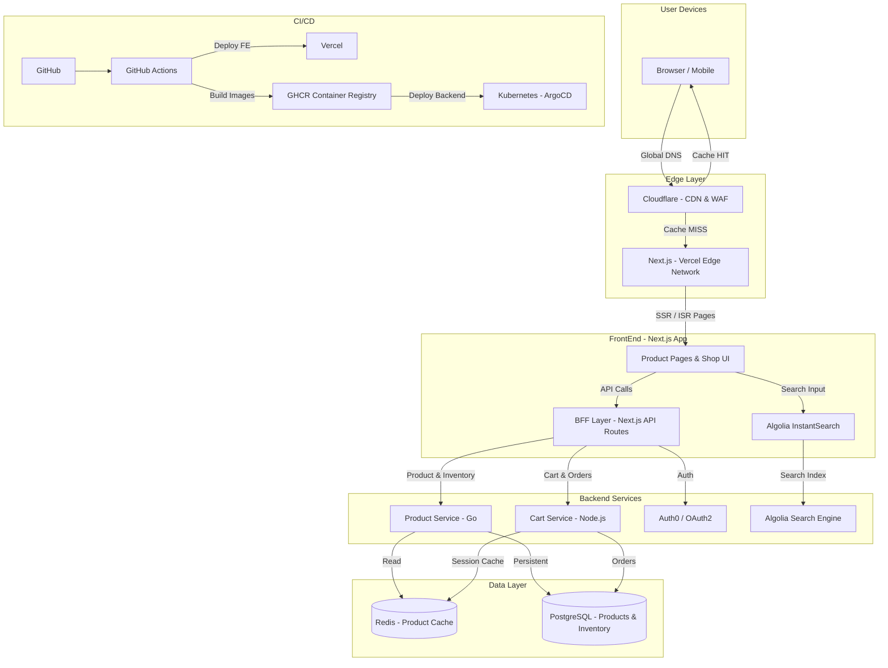

# FrontEnd Application Architecture — Scenario A: No Technical Limitations (Best of Breed)

> **Model:** Claude Sonnet 4.6 | **Domain:** FrontEnd Application | **Scenario:** Technology Agnostic

---

## Design Philosophy

With no constraints the design prioritises **performance at the edge**, **developer experience**, and **conversion rate optimisation**. For an e-commerce product showcase and shop, page load time directly correlates with revenue; therefore the architecture places rendering and caching as close to the user as possible. Backend-for-Frontend (BFF) pattern isolates the frontend from internal service complexity.

---

## Architecture Diagram

---

## Component Table

| Component | Usage | Why | Alternatives Considered |
| :--- | :--- | :--- | :--- |
| **Next.js on Vercel** | Product showcase pages, shop UI, SSR/ISR rendering, and BFF API routes. | Hybrid rendering (SSG/SSR/ISR) maximises SEO and performance; Vercel's edge network provides instant global deployments with zero DevOps overhead. | 1. Remix — excellent streaming SSR but smaller ecosystem and fewer hosting options. 2. Nuxt.js — Vue-based equivalent, but React/Next.js commands a significantly larger talent pool. |
| **Cloudflare (CDN + WAF + Workers)** | Edge caching for HTML, assets, and API responses; WAF for bot protection; Edge Workers for personalisation logic. | Largest global PoP network; Cloudflare Workers allow running personalisation logic at the edge without cold starts; best-in-class DDoS mitigation. | 1. Fastly — comparable performance but more expensive for high traffic. 2. AWS CloudFront — solid but slower iteration and fewer edge compute features. |
| **Algolia** | Full-text product search, filtering, faceting, and personalised ranking. | Sub-10ms search latency; purpose-built for e-commerce merchandising; InstantSearch UI components reduce frontend build time significantly. | 1. Elasticsearch (OpenSearch) — more flexible but requires significant operational expertise to tune for search relevance. 2. Meilisearch — fast and open-source but fewer e-commerce merchandising features. |
| **Redis (Upstash / Redis Enterprise)** | Distributed cache for product catalogue, cart sessions, and rate limiting. | Microsecond read latency; rich data structures (sorted sets for leaderboards, hashes for sessions); highly reliable with Redis Sentinel/Cluster. | 1. Memcached — simpler but lacks persistence and rich data structures. 2. DynamoDB DAX — AWS-specific and only useful for DynamoDB offloading. |
| **Go (Product Service)** | High-throughput, low-latency service for reading product catalogue and inventory data. | Compiled, statically typed; handles large concurrent request volumes with minimal memory footprint; ideal for read-heavy API services. | 1. Rust — even higher performance but slower development velocity for typical teams. 2. Java Spring Boot — proven for enterprise workloads but higher memory overhead than Go. |
| **Node.js / Fastify (Cart Service)** | Cart management, checkout orchestration, and order processing. | Shares language with the BFF layer; Fastify has lower overhead than Express; fast iteration for business-logic-heavy services. | 1. Go — lower overhead but adds a second language to the stack. 2. Python FastAPI — excellent for ML-augmented services but higher latency under concurrency. |
| **Auth0** | Authentication, authorisation, and identity management for customers and admins. | Managed IdP with OIDC/OAuth2 support; handles social login, MFA, and anomaly detection without building auth infrastructure. | 1. Keycloak — open-source and self-hosted, but significant ops burden. 2. Clerk — newer, excellent DX but less mature for enterprise-grade requirements. |
| **PostgreSQL** | Persistent relational store for products, orders, inventory, and customer data. | ACID compliance for financial transactions; rich querying and JSON support; the most reliable open-source RDBMS. | 1. MySQL — solid alternative but PostgreSQL has superior JSON and full-text search capabilities. 2. CockroachDB — horizontally scalable but adds distributed transaction complexity. |
| **GitHub Actions + ArgoCD + Vercel** | Automated CI pipelines triggering Vercel preview deployments for FE and GitOps CD for backend services. | Vercel preview deployments allow per-PR testing of the full SSR app; ArgoCD GitOps ensures backend is self-healing and auditable. | 1. CircleCI — fast pipelines but adds another SaaS tool without reducing complexity. 2. Netlify — comparable to Vercel for static/edge, but fewer Next.js-specific optimisations. |

---

## Key Architectural Decisions

- **ISR (Incremental Static Regeneration) for product pages** — Product pages are pre-rendered at build time and stale-while-revalidate on cache miss. This means zero server cost for the majority of page views and always-fresh content within the revalidation window.
- **BFF pattern** — Next.js API Routes act as the Backend-for-Frontend, aggregating calls to multiple backend microservices and shaping responses for the UI. This prevents the frontend from directly coupling to internal service contracts.
- **Algolia as a separate search index** — Product search is served from a dedicated search index, never from the primary database. This decouples search scaling from transactional scaling.
- **Edge personalisation** — Cloudflare Workers read a lightweight user segment cookie and serve A/B variants or personalised hero banners without round-tripping to the origin.

