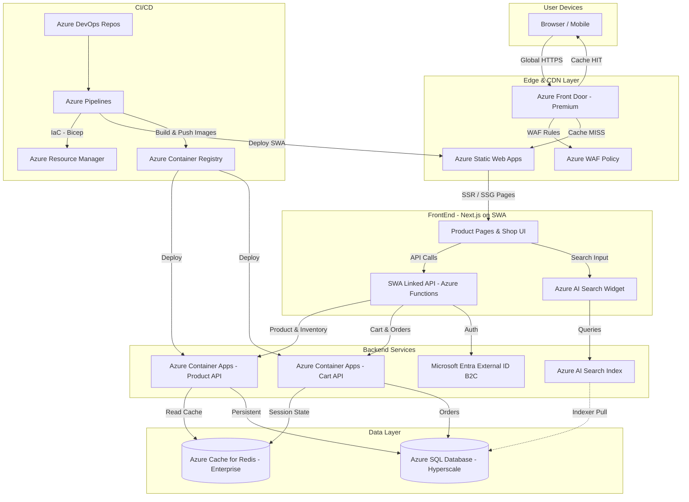

# FrontEnd Application Architecture — Scenario B: Azure Solution Architect

> **Model:** Claude Sonnet 4.6 | **Domain:** FrontEnd Application | **Scenario:** Azure Native

---

## Design Philosophy

As an Azure Solution Architect the design maximises **managed Azure PaaS services** to reduce operational overhead while meeting enterprise security, compliance, and performance requirements. Microsoft's global network, combined with Azure Static Web Apps and Azure Front Door, provides a competitive edge delivery experience without leaving the Azure ecosystem.

---

## Architecture Diagram

---

## Component Table

| Component | Usage | Why | Alternatives Considered |
| :--- | :--- | :--- | :--- |
| **Azure Front Door Premium** | Global entry point: anycast routing, CDN edge caching, TLS termination, and WAF enforcement. | Premium tier includes Azure-managed rule sets, Bot Manager, and Private Link origins — providing global performance and enterprise security in a single managed service. | 1. Azure CDN Classic — being retired; limited edge compute capabilities. 2. Azure Application Gateway — regional only, not suitable for global product showcase traffic. |
| **Azure Static Web Apps (SWA)** | Hosts the Next.js frontend with SSR support, globally distributed static assets, and linked backend Functions. | First-class Next.js SSR support via hybrid rendering; automatically provisions preview environments per pull request; deeply integrated with Azure DevOps. | 1. Azure App Service — more flexible but requires more infrastructure management for a frontend app. 2. Azure Container Apps — overkill for a frontend app; SWA provides native CI/CD integration. |
| **Azure Functions (SWA Linked API)** | Backend-for-Frontend (BFF) layer: aggregates product, cart, and auth APIs for the frontend. | Serverless scaling to zero; native integration as SWA linked API shares auth context with the frontend automatically; cost-effective for variable e-commerce traffic patterns. | 1. Azure Container Apps — better for long-running workloads; BFF is inherently short-lived. 2. Azure API Management — adds a management plane appropriate for external partner APIs, not internal BFF needs. |
| **Azure AI Search** | Managed search engine for full-text product search, faceting, filtering, and semantic ranking. | Native Azure service with built-in AI enrichment pipelines; automatic indexer pull from Azure SQL; semantic search capability powered by Azure OpenAI for natural language queries. | 1. Elasticsearch on Azure Marketplace — more operational overhead and licensing cost. 2. Algolia — excellent but introduces a third-party SaaS dependency outside the Azure governance boundary. |
| **Azure Container Apps** | Hosts the Product API and Cart API as microservices with KEDA-based auto-scaling. | Event-driven scaling (including scale-to-zero); managed Dapr side-car for service-to-service resilience; VNet-integrated without managing AKS control planes. | 1. Azure Kubernetes Service — more control but significant operational complexity for a product team focused on features. 2. Azure App Service (Containers) — simpler but lacks KEDA scaling and Dapr integration. |
| **Microsoft Entra External ID (B2C)** | Customer identity: registration, social login, MFA, and token issuance. | Native to the Microsoft identity platform; seamless integration with SWA authentication; enterprise-grade compliance (SOC2, ISO27001, GDPR) managed by Microsoft. | 1. Auth0 — excellent but introduces a third-party IdP dependency outside the Azure trust boundary. 2. Azure AD (workforce) — designed for employees, not customer-facing B2C scenarios. |
| **Azure Cache for Redis (Enterprise)** | Distributed cache for product catalogue, cart sessions, and rate limiting. | Enterprise tier uses Redis modules (RedisSearch, RedisJSON) and provides active geo-replication for multi-region scenarios; 99.999% SLA on zone-redundant clusters. | 1. Azure Cache for Redis (Standard) — lacks active geo-replication and Redis modules needed for session reliability. 2. Azure Cosmos DB (integrated cache) — less flexible for session data; cache use case is not its primary strength. |
| **Azure SQL Database Hyperscale** | Primary persistent store for product catalogue, inventory, orders, and customer data. | Hyperscale tier provides up to 100 TB storage, fast backups, and named replicas for read-offloading — ideal for a growing e-commerce catalogue and order history. | 1. Azure Cosmos DB — better for globally distributed, low-latency writes, but relational integrity is important for order processing. 2. Azure Database for PostgreSQL — excellent, but Azure SQL has deeper tooling integration with the Microsoft stack. |
| **Azure DevOps + Azure Pipelines** | Source control, multi-stage CI/CD with environment promotion gates, and infrastructure-as-code via Bicep. | Per-PR preview environments via SWA integration; approval gates between staging and production; deep native integration with Azure Resource Manager and Container Registry. | 1. GitHub Actions — valid for OSS; Azure DevOps provides stronger enterprise governance (branch policies, audit logs, compliance). 2. GitLab CI — adds self-hosting complexity for an Azure-committed organisation. |

---

## Key Architectural Decisions

- **Azure Front Door Premium over CDN Classic** — Front Door Premium provides both the CDN layer and the WAF with bot protection in a single managed service, reducing the number of hops and management surfaces in the critical path.
- **SWA as the frontend host** — Static Web Apps handles per-PR preview deployments natively with Azure DevOps, eliminating the need to configure preview environments manually — a significant DX improvement for the product team.
- **AI Search semantic ranking** — Azure AI Search with semantic ranking, powered by Azure OpenAI, enables natural language product queries ("red winter jacket under \$100") without additional ML infrastructure.
- **Container Apps over AKS** — KEDA-based scale-to-zero reduces cost during off-peak hours (overnight, weekends) which is critical for e-commerce workloads with highly variable traffic patterns.
- **Entra External ID over third-party IdP** — Keeping identity within the Microsoft trust boundary simplifies compliance attestation and eliminates outbound dependencies on third-party auth services.

