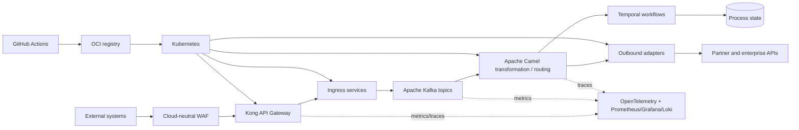

# Enterprise Integration Architecture — Scenario A

**Context:** green-field, best-of-breed design with no cloud-provider constraint. The platform receives API requests and events from external systems, transforms canonical business data, invokes downstream systems, tracks long-running business processes, and exposes operational insight.

## Architecture

Kafka provides durable, replayable integration events. Services publish a canonical model and use an outbox pattern for reliable database-to-event publication. Temporal coordinates retries, timeouts, compensation, approvals, and process status; it is not used as the high-volume event bus.

## Components and decisions

| Component | Usage | Why | 2 alternatives considered |
|---|---|---|---|
| Kong Gateway | Incoming APIs, authentication, throttling, versioning | Portable, performant, Kubernetes-friendly, and extensible with plugins | Apigee; Tyk |
| Kubernetes | Runs gateway, adapters, and transformation services | Portable scheduling, scaling, isolation, and a large ecosystem | Nomad; OpenShift |
| Apache Kafka | Buffering, decoupling, replay, and fan-out | Durable event log suited to high-volume enterprise integration | RabbitMQ; NATS JetStream |
| Apache Camel | Protocol adapters, routing, validation, and transformation | Mature enterprise integration patterns and broad connector support | MuleSoft; Spring Integration |
| PostgreSQL | Operational data, idempotency keys, outbox, and audit references | Strong transactions and relational reporting without unnecessary complexity | CockroachDB; MySQL |
| Temporal | Business process tracking and long-running orchestration | Durable workflow state, deterministic retries, and compensation logic in code | Camunda; Netflix Conductor |
| OpenTelemetry + Prometheus/Grafana/Loki | Metrics, traces, logs, dashboards, and alerting | Open standards and replaceable backends reduce observability lock-in | Datadog; Elastic Observability |
| GitHub Actions + Argo CD | CI tests/builds and GitOps CD to Kubernetes | Clear separation of build from environment promotion and auditable deployments | GitLab CI/CD; Jenkins + Flux |
| Vault | Secrets, certificates, and rotation | Centralized secret lifecycle with Kubernetes integration | External Secrets Operator; CyberArk |

## Key decisions

- Use synchronous APIs only where the caller needs an immediate result; use Kafka for integration work that can be asynchronous.
- Require correlation IDs, idempotency keys, schema versioning, dead-letter topics, and replay procedures on every flow.
- Keep partner-specific mapping in adapters around a canonical domain model; this prevents point-to-point transformation sprawl.
- Store business process state separately from transient message state so support teams can answer “where is this order?” reliably.
- Promote immutable container artifacts through environments. Contract tests and consumer-driven API tests run before deployment.

## Delivery and operational controls

CI runs linting, unit and mapping tests, API/schema compatibility checks, container scanning, and infrastructure validation. CD deploys to Kubernetes through GitOps with canary or blue/green release strategies. SLOs should cover API availability/latency, event age, failed-message rate, workflow completion time, and partner error rate.

