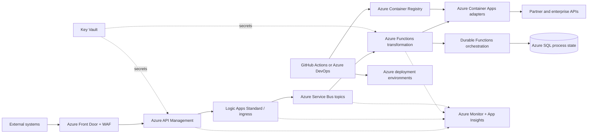

# Enterprise Integration Architecture — Scenario B

**Context:** Azure-first implementation using managed services where they reduce operational work and integrate with Microsoft identity, security, networking, and governance.

## Architecture

API Management is the controlled ingress and egress policy boundary. Service Bus supplies durable commands/events, duplicate detection, dead-letter queues, sessions, and ordered processing where required. Logic Apps is used for connector-heavy flows; Functions and Container Apps handle code-heavy transformations and partner adapters. Durable Functions tracks long-running processes with checkpoints and retries.

## Components and decisions

| Component | Usage | Why | 2 alternatives considered |
|---|---|---|---|
| Azure Front Door + WAF | Global entry, TLS termination, edge routing, web/API protection | Global availability, Microsoft-managed edge, and integrated WAF policies | Application Gateway; Cloudflare |
| Azure API Management | Incoming/outgoing APIs, auth, quotas, policies, products, developer portal | Central policy enforcement, OpenAPI support, subscription controls, and Azure integration | Kong on AKS; Apigee |
| Logic Apps Standard | Connector-based ingestion and integration workflows | Fast delivery for SAP/SaaS/HTTP connectors with managed triggers and actions | Power Automate; MuleSoft |
| Azure Service Bus | Commands/events, buffering, retries, DLQs, and duplicate detection | Enterprise messaging semantics without operating brokers | Event Hubs; Event Grid |
| Azure Functions | Stateless transformations, validation, enrichment, and lightweight adapters | Pay-per-use/serverless scale and native Azure bindings | Container Apps jobs; Logic Apps code actions |
| Azure Container Apps | Stateful/complex partner adapters and always-on APIs | Managed containers with revisions, autoscaling, and less platform overhead than AKS | AKS; App Service |
| Durable Functions + Azure SQL | Business process tracking, checkpoints, status, and audit projections | Durable orchestration plus transactional relational reporting | Logic Apps stateful workflows; Azure Workflow Orchestration Manager |
| Azure Monitor + Application Insights | Logs, metrics, traces, alerts, dashboards, workbooks | Native correlation across APIM, Functions, Service Bus, and containers | Datadog; Elastic Stack |
| Key Vault + Managed Identity | Secrets, certificates, keys, and service-to-service access | Removes credentials from code and supports Azure RBAC/rotation | Managed HSM; CyberArk |
| GitHub Actions or Azure DevOps + Bicep | CI/CD and repeatable infrastructure | Policy gates, environment approvals, artifact promotion, and Azure-native IaC | Jenkins; Terraform |

## Key decisions

- Use Entra ID for workforce/service authentication; use OAuth2, mTLS, or signed requests for partners as required.
- Use Service Bus for business messages requiring delivery guarantees; use Event Grid for lightweight notifications and Event Hubs only for telemetry-scale streams.
- Prefer Logic Apps for configuration-led connector flows and Functions/Container Apps for source-controlled, test-heavy transformations.
- Place resources in a hub-and-spoke virtual network with private endpoints for Service Bus, SQL, Key Vault, and Container Registry.
- Apply Azure Policy, Defender for Cloud, resource locks, diagnostic settings, and centralized Log Analytics from the first deployment.

## Delivery and operational controls

CI performs unit, mapping, contract, security, IaC, and container scans. Deployment uses Bicep and environment approvals, with APIM revisions and Container Apps revisions enabling controlled rollout and rollback. Operational SLOs include APIM availability, Service Bus queue age, dead-letter growth, workflow completion time, and downstream dependency failures.

