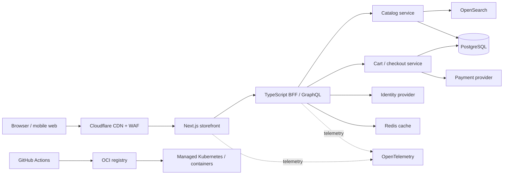

# Product Frontend Architecture — Scenario A

**Context:** green-field product discovery and commerce application with no provider constraint. The design supports product showcase pages, cart and checkout, search, caching, backend business logic, and independent delivery of frontend and services.

## Architecture

Next.js provides server-rendered, SEO-friendly product pages and a responsive client experience. The BFF presents a stable frontend-oriented contract and hides service topology. Catalog reads are cached aggressively; cart, inventory reservation, price calculation, and payment authorization remain authoritative backend operations.

## Components and decisions

| Component | Usage | Why | 2 alternatives considered |
|---|---|---|---|
| Next.js + TypeScript | Product showcase, navigation, cart UI, SEO pages | SSR/streaming, mature React ecosystem, and strong type safety | Nuxt; SvelteKit |
| Cloudflare CDN/WAF | Static assets, page caching, TLS, edge protection | Global edge performance and vendor-neutral origin support | Fastly; Akamai |
| TypeScript BFF with GraphQL | Frontend aggregation and tailored API contract | Avoids over-fetching and keeps browser unaware of service boundaries | REST BFF; tRPC |
| PostgreSQL | Products, prices, carts, orders, and transactional data | ACID transactions and flexible relational commerce queries | MySQL; CockroachDB |
| Redis | Session/cart acceleration, hot catalog data, rate limits | Low-latency cache with TTLs and atomic operations | Memcached; KeyDB |
| OpenSearch | Product text, filters, facets, and ranking | Search-native indexing and tunable relevance | Elasticsearch; Typesense |
| Auth0 | Customer identity, login, MFA, and social providers | Mature hosted identity flows reduce security implementation risk | Keycloak; Clerk |
| Stripe | Payment authorization, checkout, refunds, and webhooks | Keeps card data out of the platform and has strong developer tooling | Adyen; Braintree |
| Kubernetes + managed PostgreSQL | Runs BFF/services and persists core data | Portability and independent scaling for a growing domain | Nomad; serverless containers |
| GitHub Actions + Argo CD | Test, build, scan, and deploy frontend/services | Automated promotion and GitOps auditability | GitLab CI/CD; Buildkite |

## Key decisions

- Cache public product pages and catalog responses with short TTLs plus explicit invalidation on catalog publication.
- Never treat cached price, stock, cart, or payment state as authoritative; revalidate at checkout.
- Use a search projection populated from catalog events, allowing search to scale independently from the transactional database.
- Keep BFF aggregation separate from domain rules. Pricing, promotions, stock reservation, order state, and payment reconciliation belong to backend services.
- Use feature flags and preview environments for safe storefront releases.

## Delivery and operational controls

CI runs type checking, unit/component tests, accessibility checks, API contract tests, end-to-end checkout tests, dependency scanning, and Lighthouse performance budgets. CD publishes immutable images and static assets, then uses canary releases. Track Core Web Vitals, search success rate, add-to-cart conversion, checkout failure rate, API latency, and cache hit ratio.

