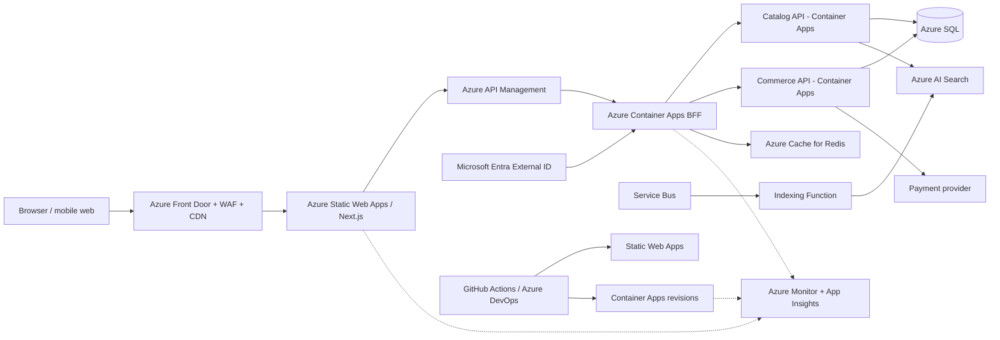

# Product Frontend Architecture — Scenario B

**Context:** Azure-first storefront and commerce platform, using managed services and Microsoft security/governance integration.

## Architecture

Static Web Apps hosts the Next.js frontend where its supported rendering model fits the application; Container Apps hosts the BFF and domain APIs with revision-based deployment. Azure AI Search owns full-text search, filters, facets, and relevance. Service Bus plus an indexing Function keeps the search index eventually consistent with the catalog database.

## Components and decisions

| Component | Usage | Why | 2 alternatives considered |
|---|---|---|---|
| Azure Static Web Apps + Next.js | Product pages, showcase content, browser application, preview environments | Managed web hosting, CDN integration, and simple branch deployments | App Service; Azure Storage Static Website |
| Azure Front Door + WAF | Global routing, CDN, TLS, and edge protection | Single managed global entry point with WAF policies | Application Gateway; Cloudflare |
| API Management | API facade, quotas, auth policies, versioning, and observability | Centralized Azure-native control plane for browser and partner APIs | YARP; Kong on AKS |
| Azure Container Apps | BFF, catalog, cart, checkout, and backend business logic | Managed container revisions, autoscaling, ingress, and low platform burden | App Service; AKS |
| Azure SQL Database | Products, carts, orders, prices, and transactional rules | Relational integrity, mature tooling, and managed HA/backups | Cosmos DB; PostgreSQL Flexible Server |
| Azure Cache for Redis | Hot catalog/cache data, sessions, rate limiting | Managed low-latency cache with Azure integration | In-memory cache; Cosmos DB integrated cache |
| Azure AI Search | Product search, facets, filters, autocomplete, and ranking | Managed semantic/full-text capabilities and Azure integration | Elasticsearch; Azure Database for PostgreSQL search |
| Microsoft Entra External ID | Customer registration, sign-in, tokens, and federation | Azure-native CIAM and integration with API authorization | Auth0; Keycloak |
| Service Bus + Azure Functions | Catalog change events and search-index updates | Durable delivery, retry/DLQ, and serverless indexing | Event Grid; Logic Apps |
| Azure Monitor + Application Insights | Frontend and backend telemetry, alerts, and dashboards | Native distributed correlation and operational integration | Datadog; New Relic |
| GitHub Actions or Azure DevOps + Bicep | CI/CD, tests, environment promotion, and IaC | Repeatable Azure deployments with approvals and policy gates | Jenkins; Terraform |

## Key decisions

- Use Front Door caching for immutable assets and public content, while bypassing cache for authenticated or personalized responses.
- Use Entra External ID for identity, but keep authorization and commerce rules in backend services.
- Use SQL as the source of truth; treat AI Search and Redis as rebuildable projections/caches.
- Use private endpoints, managed identities, Key Vault, Azure Policy, Defender for Cloud, and centralized diagnostics.
- Prefer Container Apps for an initial service-oriented deployment; move to AKS only when workload density, platform control, or networking requirements justify the additional operating model.

## Delivery and operational controls

CI includes TypeScript checks, unit/component/accessibility tests, Playwright checkout tests, API contracts, dependency and container scans, and Bicep validation. CD deploys Static Web Apps and Container Apps revisions with staged traffic percentages and rollback. Measure Core Web Vitals, cache hit rate, search zero-result rate, checkout conversion/failure, API latency, and dependency health.

