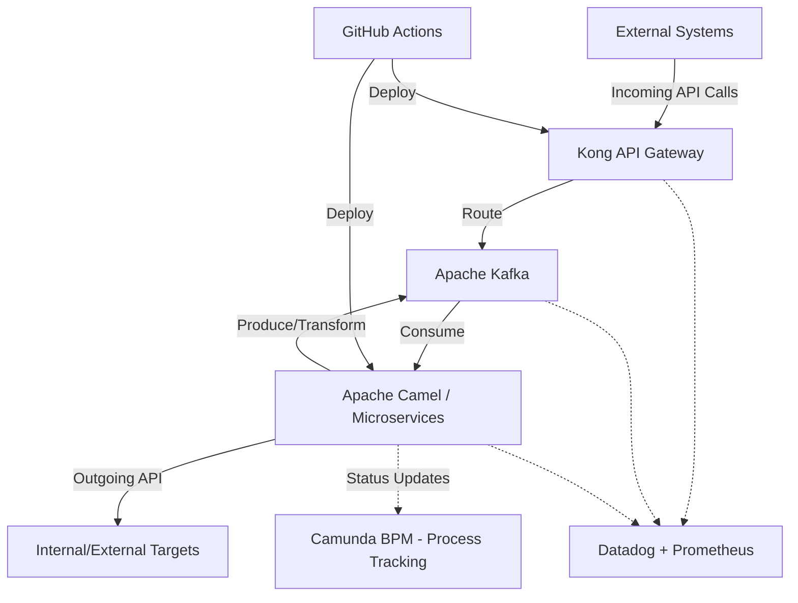

# Enterprise Integration Architecture (Scenario A: Technology Agnostic / Best of Breed)

This document outlines the architecture for an enterprise integration platform using a "best-of-breed" technology stack without cloud vendor lock-in constraints.

## Architecture Diagram

## Component Details

| Component | Usage | Why | 2 Alternatives Considered |
| :--- | :--- | :--- | :--- |
| **Kong API Gateway** | Manages incoming API requests, routing, rate limiting, and authentication. | High performance, vast plugin ecosystem, and platform-agnostic (runs natively on Kubernetes). | 1. AWS API Gateway 2. Apigee |
| **Apache Kafka** | Message broker for data stream processing, buffering, and decoupling components. | High throughput, fault-tolerant, industry standard for event-driven integration and replayability. | 1. RabbitMQ 2. Amazon Kinesis |
| **Apache Camel** | Handling complex data transformations, routing, and system integrations. | Extensive library of enterprise integration patterns (EIPs) and connectors for almost any protocol. | 1. MuleSoft 2. Spring Integration |
| **Camunda** | Business process tracking, workflow orchestration, and state management. | Standardized BPMN support, highly scalable, and developer-friendly for complex long-running processes. | 1. Temporal 2. AWS Step Functions |
| **Datadog + Prometheus** | End-to-end monitoring, logging, and distributed tracing across the integration pipeline. | Comprehensive observability capabilities tailored for distributed microservice and container architectures. | 1. Splunk 2. Elastic Stack (ELK) |
| **GitHub Actions** | CI/CD pipelines for automating testing, building, and deploying the integration services. | Native integration with source control, huge marketplace of community actions, and low maintenance. | 1. GitLab CI/CD 2. Jenkins |

