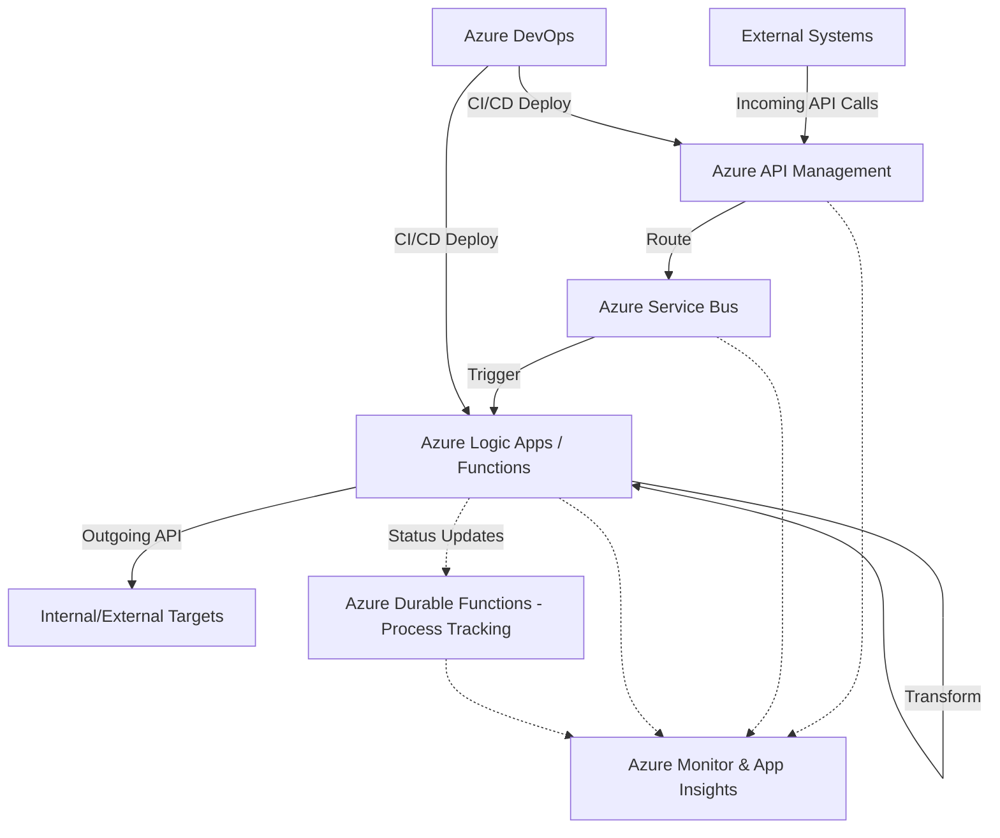

# Enterprise Integration Architecture (Scenario B: Azure Solution Architect)

This document outlines the architecture for an enterprise integration platform utilizing a native Microsoft Azure technology stack.

## Architecture Diagram

## Component Details

| Component | Usage | Why | 2 Alternatives Considered |
| :--- | :--- | :--- | :--- |
| **Azure API Management (APIM)** | Secures and manages incoming API traffic, rate limiting, and transformations at the edge. | Deep integration with Azure services, excellent security features, and built-in developer portal. | 1. Azure Front Door (more for global routing/WAF) 2. Kong on AKS |
| **Azure Service Bus** | Enterprise message broker for reliable asynchronous communication and decoupling. | Supports advanced messaging features like sessions, dead-lettering, and transactional processing. | 1. Azure Event Grid 2. Azure Event Hubs |
| **Azure Logic Apps** | Visual workflow designer for data transformation, routing, and outgoing API connections. | Hundreds of out-of-the-box connectors, low-code transformation, and serverless scaling. | 1. Azure Functions (Code-first) 2. Azure Data Factory |
| **Azure Durable Functions** | Business process tracking, managing stateful long-running workflows and orchestrations. | Code-first state management, natively integrates with the Azure ecosystem, cost-effective serverless model. | 1. Logic Apps (Stateful) 2. BizTalk Server (Legacy) |
| **Azure Monitor & App Insights** | Centralized logging, distributed tracing, and performance monitoring. | Native telemetry platform for all Azure services, providing end-to-end transaction visibility. | 1. Datadog 2. New Relic |
| **Azure DevOps** | CI/CD pipelines, source control, and agile project tracking. | Enterprise-grade security, deep integrations with Azure ARM/Bicep deployments, and unified tooling. | 1. GitHub Actions 2. GitLab CI |

