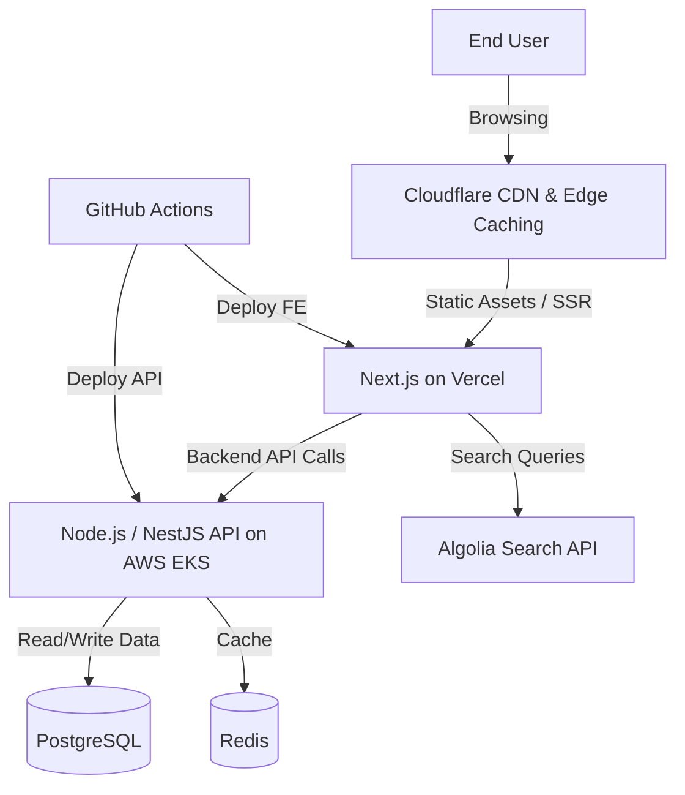

# FrontEnd Application Architecture (Scenario A: Technology Agnostic / Best of Breed)

This document outlines the architecture for a modern, scalable e-commerce frontend application using a "best-of-breed" technology stack.

## Architecture Diagram

## Component Details

| Component | Usage | Why | 2 Alternatives Considered |
| :--- | :--- | :--- | :--- |
| **Next.js (React) on Vercel** | Frontend framework to showcase products and handle shop UI (SSR/SSG). | Excellent developer experience, hybrid static/server rendering for SEO, and zero-config deployment. | 1. Nuxt.js (Vue) 2. Remix |
| **Cloudflare** | Global edge network for caching static assets and API responses, plus WAF. | Industry-leading performance, DDoS protection, and edge compute capabilities. | 1. Fastly 2. AWS CloudFront |
| **Node.js / NestJS (on Kubernetes)** | Core backend business logic, cart management, and checkout processing. | Highly scalable, shares language (TypeScript) with frontend, strict architecture via NestJS. | 1. Go (Golang) 2. Java Spring Boot |
| **Algolia** | Dedicated search engine for lightning-fast product discovery and filtering. | Unmatched search latency, typo tolerance, and built-in e-commerce merchandising features. | 1. Elasticsearch 2. Meilisearch |
| **Redis** | Distributed caching for session state, cart data, and frequent database queries. | In-memory speed, simple data structures, and highly reliable. | 1. Memcached 2. Hazelcast |
| **GitHub Actions** | CI/CD pipelines for automating frontend builds and backend container deployments. | Unified location for code and pipelines, vast ecosystem of deployment actions. | 1. CircleCI 2. Jenkins |

