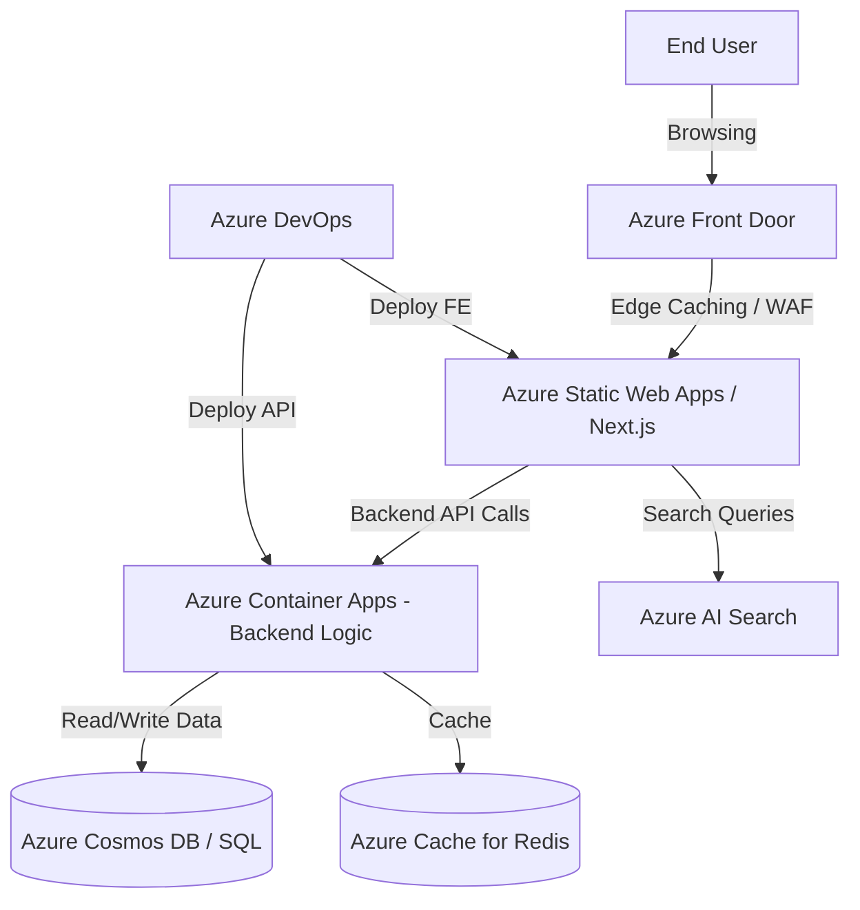

# FrontEnd Application Architecture (Scenario B: Azure Solution Architect)

This document outlines the architecture for a modern e-commerce frontend application built entirely on the Microsoft Azure platform.

## Architecture Diagram

## Component Details

| Component | Usage | Why | 2 Alternatives Considered |
| :--- | :--- | :--- | :--- |
| **Azure Static Web Apps (with Next.js)** | Frontend hosting to showcase products and manage the shop UI. | Native support for Next.js SSR/SSG, seamless integration with GitHub/Azure DevOps, globally distributed. | 1. Azure App Service 2. AKS (Azure Kubernetes Service) |
| **Azure Front Door** | Global entry point providing CDN, dynamic edge caching, and Web Application Firewall. | Optimizes global routing, caches static/dynamic content close to users, and provides enterprise security. | 1. Azure CDN (Standard) 2. Azure Application Gateway |
| **Azure Container Apps** | Serverless container platform hosting the backend business logic and APIs. | Event-driven autoscaling (KEDA) down to zero, microservices friendly without managing K8s clusters. | 1. Azure App Service (Web Apps) 2. Azure Kubernetes Service (AKS) |
| **Azure AI Search** | Search engine for full-text search, product discovery, filtering, and facets. | Fully managed, AI-powered relevance, easily ingests data from Azure data stores. | 1. Elasticsearch on Azure 2. Algolia |
| **Azure Cache for Redis** | Distributed caching for cart state, session management, and DB query offloading. | Fully managed, high throughput, low latency, and highly available. | 1. Azure Cosmos DB (integrated cache) 2. Self-hosted Redis on VMs |
| **Azure DevOps** | Enterprise CI/CD pipelines to build, test, and deploy both frontend and backend. | Robust enterprise governance, native deployment tasks for Azure resources, and integrated testing. | 1. GitHub Actions 2. GitLab CI |

