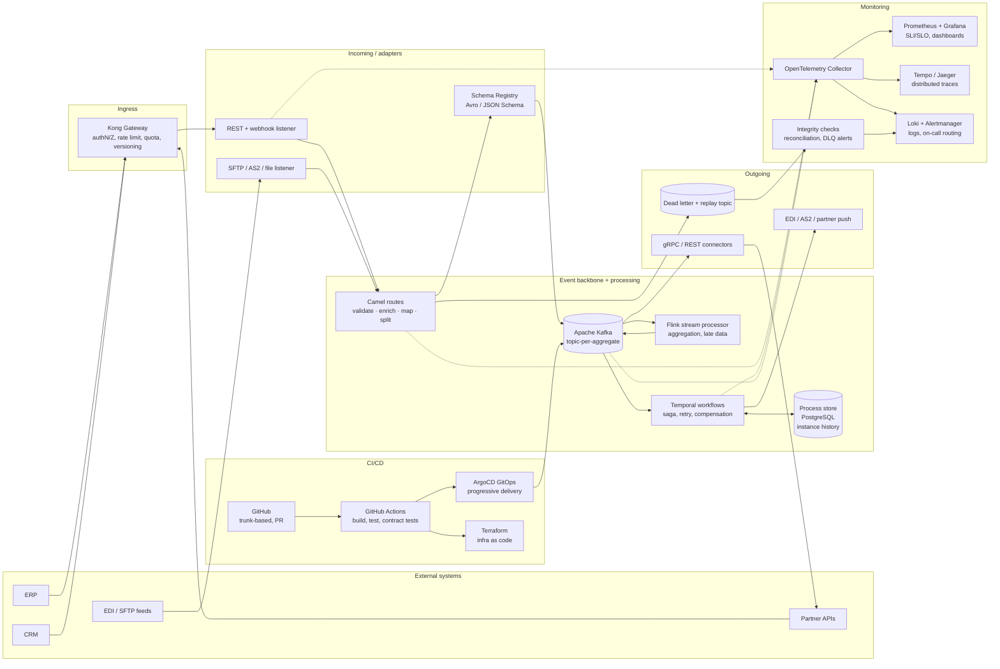

# 1. Enterprise Integration with External Systems via APIs — Scenario A (no technical limitations)

**Model:** big-pickle · **Subject:** Enterprise Integration · **Scenario:** A — green field, no constraints on stack, hosting or licensing

## Context

An integration layer must accept data from external systems (ERP, CRM, partners, B2B feeds), transform it, publish it onward, monitor everything, track business processes end-to-end, and ship via CI/CD. With no limits, the stack is chosen purely on fitness: durable execution, open standards, portability, and operability.

## Chosen stack (summary)

Event-driven core (**Apache Kafka**) + route/adapter layer (**Apache Camel**) + durable workflow engine (**Temporal**) on **Kubernetes**, fronted by **Kong Gateway**, instrumented with **OpenTelemetry → Prometheus/Grafana/Tempo/Loki**, delivered by **GitHub Actions + ArgoCD + Terraform**.

## Architecture

## Components

| Component | Usage | Why this choice | Alternative 1 considered | Alternative 2 considered |
|---|---|---|---|---|
| **Kong Gateway** | Incoming API entry point: TLS, auth (OIDC/JWT), rate limiting, quotas, request validation, versioning, developer portal for partner onboarding | Declarative, plugin-rich, runs anywhere (K8s/EC2), Kong Enterprise adds FIPS/audit; keeps protocol concerns out of business code | **Kong's** direct rival **Apache APISIX** (chosen for slightly leaner core, but Kong has larger ops ecosystem) | **Envoy/Istio gateway** (great L7 mesh, weaker developer-portal and quota story) |
| **Apache Camel (camel-k)** | Inbound/outbound adapters and message transformation (validate, enrich, map, split, aggregate); 300+ connectors for ERP, SFTP, AS2, SAP | EIP implementation mature, everything is code, testable routes, easy A/B of mappings; avoids hand-rolled adapter glue | **Mule 4 / Anypoint** (strong EDI and API-led connectivity tooling, but a licensed platform whose value is orchestration UI rather than architecture) | **Bespoke TypeScript adapters** (full control, but re-implements retries, batching, backoff that Camel already solves) |
| **Apache Kafka + Schema Registry** | Durable event backbone: topic-per-aggregate, replay, decoupling of incoming from outgoing, buffer for peak loads | Log gives replay + audit for free, exactly-once producers, schema evolution (backward/forward compatible) prevents broken consumers | **Redpanda** (API-compatible, simpler ops, single binary — drop-in if Kafka operations cost becomes an issue) | **NATS JetStream / RabbitMQ** (simpler, but weaker replay/partition story for high-volume integration) |
| **Temporal.io** | Business process tracking: long-running workflows, sagas with compensation, timers, human steps, per-instance state and full history | Durable execution makes "process tracking" a by-product of running the process; retries/compensation are code, not infrastructure; queryable history = audit trail | **CamelSaga / event-sourced state machine in Kafka** (fewer moving parts, but you re-build timers, visibility, replay UI) | **Camunda 8 / Zeebe** (BPMN modelling and human task UI out of the box — best choice if business users must draw processes) |
| **Apache Flink** | Streaming transformation, joins across topics, windowed aggregation, enrichment against reference data | Exactly-once stateful stream processing next to Kafka; handles late/out-of-order data, which batch Cron jobs cannot | **Kafka Streams** (lighter, embedded in the app — fine for simpler transforms, weaker for large joins/state) | **dbt/Airflow batch jobs** (good for warehouse-shaped data, wrong latency and no event-time semantics) |
| **PostgreSQL (process store)** | Persisted Temporal history, audit trail, business-process KPIs, reconciliation results | Relational, ACID, queryable for process mining and compliance reporting; no extra licensing | **CockroachDB / Yugabyte** (horizontal scale for history) | **ClickHouse** for analytics on process events (fast aggregates, but not a source of truth) |
| **OpenTelemetry → Prometheus, Grafana, Tempo, Loki, Alertmanager** | Monitoring: metrics, traces, logs, SLOs, alerts; OTel is the single instrumentation contract across every component | Vendor-neutral, auto-instrumentation for Java/Node/Go, traces flow gateway→route→workflow→outbound so latency is explainable end-to-end | **Datadog / New Relic** (faster time-to-value, SaaS cost + data residency trade-offs) | **ELK only** (logs but no first-class metrics/traces correlation) |
| **Integrity/reconciliation job + DLQ** | Monitoring of *data correctness*: golden-source counts, checksum totals, dead-letter replay tooling | Uptime dashboards do not catch wrong data; DLQ + replay gives a safe failure mode instead of silent loss | **Flink CDC + assertions** (continuous, but adds state) | **Great Expectations / dbt tests** on the analytics side |
| **GitHub Actions + ArgoCD + Terraform** | CI/CD: build, unit/contract tests (Pact), container scan, GitOps deploy with canary, infra as code | Git as single source of truth; ArgoCD gives drift detection and instant rollback; same pipeline promotes dev→staging→prod | **GitLab CI + Flux** (equivalent, pick if GitLab is the org standard) | **Jenkins** (maximum plugin freedom, higher maintenance burden) |
| **Kubernetes (EKS/GKE) + Helm** | Runtime platform for gateway, routes, Kafka, Temporal, Flink | One operational model for stateful and stateless components, HPA for peak ingestion, ecosystem for every component above | **Nomad + Consul** (simpler scheduler, smaller ecosystem for stateful integration components) | **Serverless-only (Cloud Run/Lambda)** (cheap idle, awkward for long-lived brokers, stateful services and predictable latency) |

## Key decision rationale

1. **Events in the middle, APIs at the edges.** Incoming and outgoing systems speak request/response, but the interior is a log. That absorbs partner outages and traffic spikes, and makes every flow replayable — the cheapest form of audit.
2. **Process tracking is execution, not logging.** Temporal holds the state of every business process instance (order → validation → enrichment → delivery → acknowledgement), so tracking, retry, timeout and compensation are the same mechanism instead of three.
3. **Transformation is code + schemas.** Camel routes plus a Schema Registry keep mappings versioned, testable and contract-checked in CI; no silent breakage when a partner changes a payload.
4. **One instrumentation contract.** OpenTelemetry everywhere means a single trace ID from partner call to outbound delivery, with metrics and logs attached — no per-tool agents.
5. **Everything is declarative and portable.** No managed-service lock-in: the design runs unmodified on any cloud or on-premises, which is the point of an unconstrained scenario.

## Trade-offs / risks accepted

- Operational weight: Kafka + Flink + Temporal + K8s is a platform team, not a script — acceptable when there is no budget/limit constraint, but it must be owned.
- Camel XML/Java routes need disciplined code review to stay readable.
- If business analysts must author processes visually, swap Temporal for **Camunda 8** and keep Kafka as the transport.
