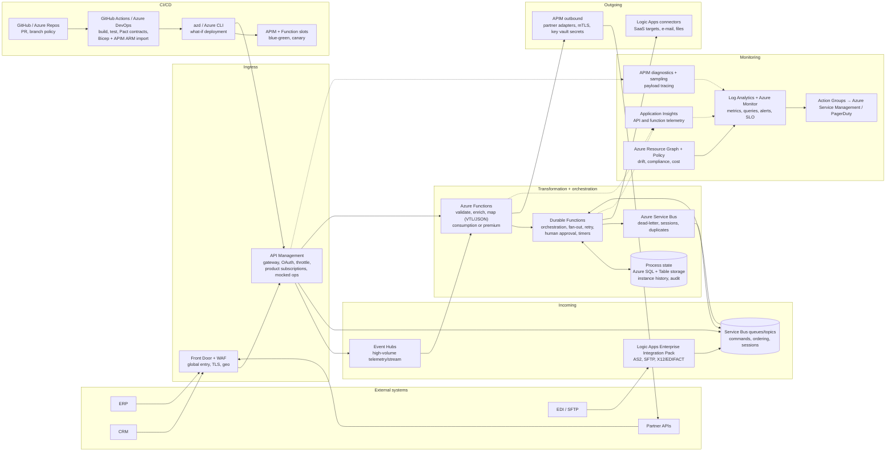

# 1. Enterprise Integration with External Systems via APIs — Scenario B (Azure solution architect)

**Model:** big-pickle · **Subject:** Enterprise Integration · **Scenario:** B — Azure, landing zone, enterprise standards (identity, governance, cost, support)

## Context

Same integration problem as Scenario A, but the design must run on Azure, fit an Azure landing zone (management groups, policy, RBAC), use managed services where they remove undifferentiated work, and be deployable through the customer's CI/CD and governance model.

## Chosen stack (summary)

**API Management** at the edge → **Service Bus** (commands) + **Event Hubs/Event Grid** (events/telemetry) → **Durable Functions** for orchestration and **Functions/Logic Apps** for transformation → **Azure SQL/Cosmos DB** for process state → **Azure Monitor / Application Insights / Log Analytics** for monitoring → **GitHub Actions + Bicep + Azure Developer CLI** for CI/CD.

## Architecture

## Components

| Component | Usage | Why this choice | Alternative 1 considered | Alternative 2 considered |
|---|---|---|---|---|
| **Azure Front Door + WAF** | Global incoming entry point: TLS termination, WAF rules against malicious payloads, geo-routing, DDoS first line, caching of static partner docs | Single global anycast edge in front of APIM; WAF satisfies most enterprise security baselines without extra appliances | **API Management alone** (built-in protection, but no global WAF/geo distribution in the Developer tier story) | **Azure Application Gateway** (WAF in-region, needs extra work for global failover) |
| **API Management (Premium/Standard)** | Incoming and outgoing API facade: OAuth2/JWT validation, rate limits and quotas per partner, versioning & products, request/response transformation (liquid templates), subscription keys, developer portal, analytics per API | Policy-based transformation without code, virtual network integration for private backends, API export/import keeps contracts in Git; the standard enterprise answer for "APIs to the outside" | **Function-centric HTTP endpoints** (cheaper at low volume, but you re-implement throttling, quotas, portal, versioning) | **MuleSoft Anypoint on Azure** (strongest connector set, extra licence and a second runtime to operate) |
| **Service Bus (queues/topics/sessions)** | Incoming command transport, decoupling of producers/consumers, ordered processing with sessions, duplicate detection, dead-letter for replay | Managed, durable, at-least-once with first-in-order support — right tool for commands and business messages; dead-letter doubles as the monitored failure queue | **Event Hubs** (better for very high throughput streams, weaker per-message routing/transactions) | **Kafka on HDInsight/AKS** (if the org already runs Kafka — higher ops cost, no extra business value here) |
| **Event Hubs / Event Grid** | High-volume incoming event streams (partner telemetry, clickstreams) and pub/sub notifications to subscribers | Event Hubs scales to GB/s with capture to Data Lake; Event Grid gives serverless push semantics for state-change events | **Service Bus topics** (fine below ~few k msg/s) | **Event Grid everywhere** (great fan-out, not for large ordered streams) |
| **Azure Functions (Consumption/Premium)** | Transformation of data: validate → enrich → map, called from APIM or triggered by Service Bus; cheap for spiky partner traffic | Pay-per-execution, built-in scaling, language flexibility (C#/Java/Python/TS), Key Vault binding for partner secrets, integration with APIM policies | **Container Apps** (more control over runtime and long-running work, more to own) | **AKS microservices** (maximum flexibility, unjustified operational cost for request-sized transforms) |
| **Durable Functions (orchestration)** | Business process tracking: the workflow state machine — retries, fan-out/fan-in, wait-for-human-approval, timers, compensation; history persisted automatically | The orchestrator's history *is* the process audit trail: queryable instance state, visualisation in the portal, exactly-once execution semantics — one mechanism for tracking and running | **Logic Apps (Consumption/Standard)** (designer-first, 100s of connectors, better for analyst-owned flows; Standard on App Service Plan is the close runner-up) | **Camunda 8 on AKS** (real BPMN/DMN and process mining, adds a platform to run and licence) |
| **Azure SQL + Table/Cosmos storage** | Persisted process instances, audit trail, reconciliation results, partner contracts/keys reference data | Relational reporting for compliance and process mining (Power BI native), familiar ops model, hybrid-join friendly | **Cosmos DB** (global distribution, elastic scale — overkill for process metadata) | **Synapse/Fabric** for analytic process mining (analytical copy, not source of truth) |
| **Application Insights + Log Analytics + Azure Monitor** | Monitoring: metrics, distributed traces (APIM → Functions → Service Bus), availability tests against incoming endpoints, alerts with SLO dashboards, KQL queries | Native to the platform, one workspace per environment, APIM emits diagnostics out of the box, no agent fleet; OpenTelemetry export keeps portability | **Third-party (Datadog, Dynatrace)** (richer APM, extra licence and data-egress cost) | **Azure Monitor only without App Insights** (infra metrics, but no end-to-end request correlation) |
| **Azure Monitor alerts + Action Groups + API Management diagnostics** | Operational monitoring of business flow: dead-letter counts, orchestration failures, partner latency, reconciliation mismatch reports | Data-correctness alerts (DLQ depth, failed compensations) alongside uptime alerts; payload sampling gives evidence in partner disputes | **Power BI + Synapse dashboards** (business-facing reporting layer — added on top, not instead) | **Logic Apps error handling only** (per-flow, no fleet-level view) |
| **GitHub Actions (or Azure DevOps) + Bicep + azd + APIM ARM import** | CI/CD: build/test, contract tests, Bicep what-if deployment, APIM configuration as code imported per environment, Function/Logic App slots, secret rotation via Key Vault | Infrastructure and API definitions are code: repeatable sandboxes, PR review of policy changes, blue-green via slots, no manual portal edits (which Azure drifts from) | **Azure DevOps YAML** (first-class Azure integration, marketplaces; identical model if the org standard is ADO) | **Terraform with azurerm** (multi-cloud IaC standard; Bicep is native and slightly ahead on Azure feature coverage) |
| **Azure Key Vault + Managed Identity + Entra ID** | Secrets, partner certificates, service-to-service auth (workload identity) | No credentials in code or pipelines; managed identities remove key rotation work; Entra ID external IDs for partner OAuth | **App Configuration + Key Vault** (add centralised feature flags) | **APIM named values with hard-coded keys** (rejected: no rotation, no audit) |
| **Azure Container Apps / App Service (optional landing for the integration UI)** | Admin UI for partner onboarding, replay tooling, process tracking dashboard (Power Apps or a small web app) | Managed container hosting with scale-to-zero; pairs with the API Management developer portal for external consumers | **Power Apps + Power Automate** (fastest for internal process apps if the licence exists) | **AKS** (only if the wider estate already runs it) |

## Key decision rationale

1. **Managed first, code second.** Every undifferentiated concern (TLS, throttling, queues, scaling, secret storage) is bought from Azure so the team writes only transformation and orchestration code.
2. **Two transports, one rule.** Commands/business messages → Service Bus (ordering, sessions, DLQ); high-volume events/streams → Event Hubs/Event Grid. Mixing them is the classic integration anti-pattern.
3. **Business process tracking = Durable Functions history.** Orchestration state, retries and human approvals live in one place; the audit table feeds Power BI for process mining. Logic Apps is the drop-in swap when the customer wants designer-owned flows.
4. **Governance by pipeline.** Bicep what-if in PRs, policy-as-code, APIM config imported from Git, per-environment service principals/managed identities — the landing zone standards are enforced before anything reaches production.
5. **Correlation from edge to backend.** APIM request correlation ID propagated into Functions and Service Bus application properties means one KQL query reconstructs a partner transaction end-to-end.

## Cost / governance notes

- Consumption-tier Functions + Standard APIM is the default cost profile; Premium Functions only when VNet integration or long-running executions are needed.
- Per-environment isolation (resource groups per stage), budgets and alerts via Cost Management, tags enforced by policy.
- Data residency: Front Door/APIM regional deployment and paired regions for geo-redundancy where policy demands it.

## Trade-offs / risks accepted

- APIM Premium is expensive at scale — start Standard, keep vNet integration as a documented upgrade path.
- Vendor coupling to Azure is intentional in this scenario; portability is preserved by keeping transformation logic in code (Functions) rather than in proprietary visual designers wherever possible.
