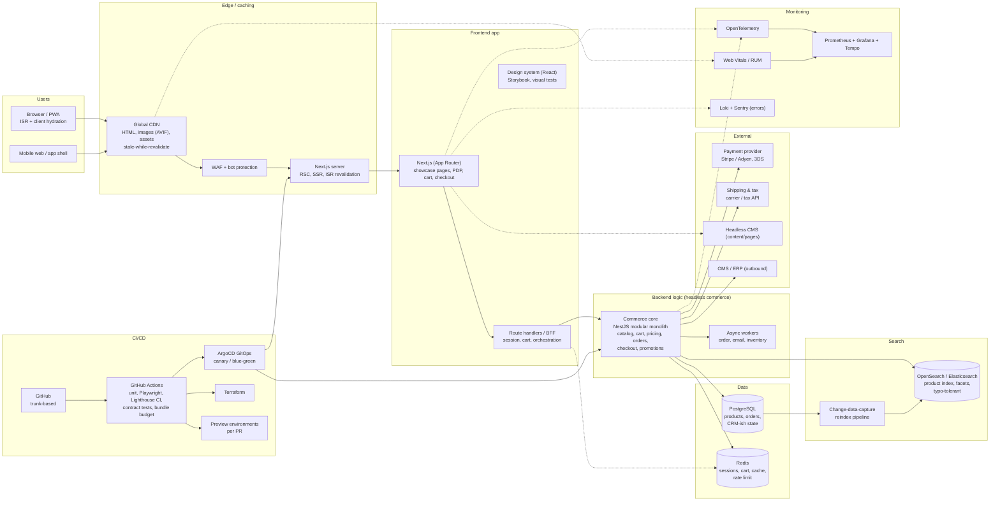

# 2. Frontend Application (showcase, shop, search) — Scenario A (no technical limitations)

**Model:** big-pickle · **Subject:** Frontend application · **Scenario:** A — green field, no constraints on stack, hosting or licensing

## Context

A commerce frontend that showcases products, supports the shop flow (cart, checkout, orders), caches aggressively, hosts the backend logic behind the UI, provides product search, and ships through CI/CD. With no limits, the choice favours performance, type safety end-to-end, and a composable (headless) core so channels and brands can be added later.

## Chosen stack (summary)

**Next.js (App Router, React Server Components) + TypeScript** at the edge with **Redis/CDN ISR caching** → **Medusa-style headless commerce core (Node/NestJS modular monolith) on Kubernetes** → **PostgreSQL + Redis** → **OpenSearch/Elasticsearch** for search → **GitHub Actions + ArgoCD + Terraform** for CI/CD, all instrumented with OpenTelemetry.

## Architecture

## Components

| Component | Usage | Why this choice | Alternative 1 considered | Alternative 2 considered |
|---|---|---|---|---|
| **Next.js (App Router) + React** | Showcase/product pages, product detail pages, cart & checkout UI; server components for fast first paint, SSR/ISR for SEO landing pages | Best-in-class rendering flexibility (static, ISR, streamed SSR), RSC cuts client JS, largest hiring pool, first-class edge deployment, mature image/font optimisation | **SvelteKit** (less JS, faster by default — smaller ecosystem/hiring pool for a long-lived commerce site) | **Remix / React Router 7** (excellent data-loading model, weaker static/ISR story for showcase pages) |
| **TypeScript everywhere + shared API contracts (tRPC/OpenAPI-generated client)** | Type-safe calls between frontend and backend logic; contracts generated from the commerce core | One build breaks on breaking changes instead of at runtime; refactor safety across two deployables | **GraphQL (Apollo/Yoga)** (great for many heterogeneous consumers, adds schema governance overhead for a single frontend) | **Plain REST + hand-written fetch wrappers** (zero tooling, drifts quickly) |
| **Global CDN + ISR (stale-while-revalidate)** | Caching: HTML pages, product images (AVIF/WebP), JSON responses; on-demand revalidation on price/stock change | Showcase traffic is read-mostly: cache hit ratio is the cheapest performance lever; SWR keeps pages fresh without origin load | **Redis-only caching** (fast, but does not remove origin round-trip for HTML at the edge) | **Client-side caching (TanStack Query)** (interactive speed, useless for first view/SEO) |
| **Redis** | Session/cart storage, hot product cache, rate limiting, BullMQ job queue for workers | One fast, well-understood store for the mutable state next to the commerce core; cart survives page reloads and devices | **Dragonfly / KeyDB** (drop-in, better memory efficiency) | **Postgres-only with short-lived sessions** (fewer moving parts, worse latency for hot keys) |
| **Headless commerce core: NestJS modular monolith (Node/TS)** | Backend logic: catalog, pricing, cart, promotions, checkout, orders, inventory reservations, webhooks | Modular monolith beats microservices for a green-field shop: one deployable, clear module boundaries, split out checkout or pricing later when justified; same language as frontend → shared types | **Medusa v2 (open-source headless commerce)** (cart/order/pricing modules out of the box — fastest start; chosen as build-vs-buy option if timelines are tight) | **commercetools / Shopify Hydrogen+SaaS** (fastest time-to-market, vendor lock-in and per-order fees) |
| **PostgreSQL** | System of record: products, variants, prices, orders, customers, stock | Relational fits commerce (orders = transactions), rich indexing, JSONB for flexible attributes, easy analytics export | **MongoDB** (flexible schemas, weaker transactional order integrity) | **Aurora/CockroachDB** (multi-region scale — only needed at much larger write volumes) |
| **OpenSearch/Elasticsearch + CDC reindex** | Search products: full-text, typo tolerance, facets, synonyms, merchandising rules, autocomplete | Search is a product feature, not a `ILIKE` query: ranking and facets drive conversion; CDC keeps the index consistent with Postgres without bespoke sync code | **Meilisearch / Typesense** (simpler, delightful UX, smaller scale and feature ceiling) | **Postgres full-text + pg_trgm** (zero extra infra, adequate until relevance requirements grow) |
| **Payment provider (Stripe/Adyen) via the commerce core** | Checkout payment authorization, 3DS, refunds, webhooks | PCI scope stays with the provider (SAQ-A style integration), fraud tooling included; provider API is swappable behind one module | **Self-hosted PSP / Adyen API-only** (more control, far more compliance surface) | **Manual bank transfer/invoice only** (rejected for online shop) |
| **Headless CMS (Sanity/Contentful/self-hosted Strapi)** | Editorial content: landing pages, lookbooks, category storytelling | Decouples marketing from deploys; preview links for editors; the shop data stays in the commerce core | **Markdown in Git** (cheapest, excludes marketing users) | **CMS built into the commerce core** (mixes editorial workflow into transactional releases) |
| **OpenTelemetry + Prometheus/Grafana/Tempo/Loki, Sentry, Web Vitals RUM** | Monitoring: backend traces, error tracking, real-user Core Web Vitals, SLO dashboards | One trace from browser → BFF → commerce core → payment; RUM ties UX regressions to business metrics | **Datadog RUM + APM** (faster insight, licence + egress cost) | **Vendor-specific Next.js analytics plugin alone** (page-level only, no backend correlation) |
| **GitHub Actions + ArgoCD + Terraform + preview environments** | CI/CD: lint, unit tests, Playwright E2E, visual regression, Lighthouse CI budget, contract tests, container build, GitOps deploy with canary, per-PR preview URL | Preview URLs make design review trivial; performance budgets in CI prevent bundle bloat; GitOps gives instant rollback of bad releases | **Vercel/Netlify platform pipelines** (fastest for Next.js, less control over where the backend runs) | **Jenkins** (flexible, high maintenance) |
| **Kubernetes (or Container Apps/VM) for core + SSR** | Runtime for the commerce core, workers and Next.js server | Uniform deploy target, HPA for peak campaigns, same GitOps flow as the rest of the estate | **Serverless containers (Cloud Run)** (scale-to-zero, request-length limits for heavy SSR/queue work) | **PaaS single service (Render/Fly)** (simple, less control over region/latency) |

## Key decision rationale

1. **Composable, not monolithic SaaS.** The frontend, commerce core and search are separate deployables with contract-tested APIs, so brand sites, apps and in-store screens can reuse the same core later.
2. **Cache read paths, transact write paths.** Showcase/search = cache (CDN + Redis + ISR); cart/checkout/payment = always live with idempotent APIs. Mixing these is how shops serve stale prices.
3. **Modular monolith first.** Microservices on day one is premature; module boundaries in one Node codebase give the same seams without distributed-system overhead, and Medusa remains the buy option if speed matters more than control.
4. **Search is a first-class service.** Indexing via CDC, relevance tuning and facet design are treated as product work with their own pipeline and quality metrics.
5. **Performance is enforced in CI.** Lighthouse budgets, bundle analysis and Playwright journeys block regressions before merge — Core Web Vitals are a release gate, not an afterthought.

## Trade-offs / risks accepted

- Node/TypeScript everywhere means one language skill set must cover frontend *and* backend; acceptable and simplifies contracts.
- Elasticsearch-class search adds an operational system; mitigate with managed OpenSearch if ops capacity is thin.
- CDN/ISR staleness requires explicit revalidation hooks on price/stock changes — implemented as domain events, not cron.
