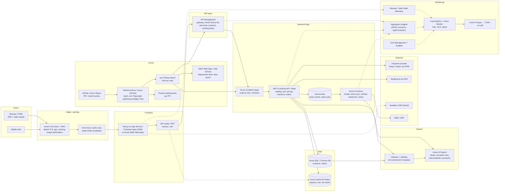

# 2. Frontend Application (showcase, shop, search) — Scenario B (Azure solution architect)

**Model:** big-pickle · **Subject:** Frontend application · **Scenario:** B — Azure, landing zone, enterprise standards (identity, governance, cost, support)

## Context

Same product: showcase pages, shop flow, caching, backend logic, search and CI/CD — but implemented with Azure platform services, aligned to an Azure landing zone, Entra ID identity, Azure Policy and cost governance, and deployable by an enterprise pipeline.

## Chosen stack (summary)

**Azure Front Door + WAF** (edge caching/TLS) → **Azure Container Apps or App Service hosting Next.js** → **API Management** in front of a **.NET 8 / Node commerce API on Azure Container Apps** → **Azure SQL + Azure Cache for Redis** → **Azure AI Search** → **Azure Functions** for async backend jobs → **Application Insights/Log Analytics** for monitoring → **GitHub Actions + Bicep + azd** for CI/CD.

## Architecture

## Components

| Component | Usage | Why this choice | Alternative 1 considered | Alternative 2 considered |
|---|---|---|---|---|
| **Azure Front Door + WAF** | Global incoming edge: TLS, WAF, geo/latency routing, CDN caching of HTML/images/API responses, stale-while-revalidate, image optimisation | One service covers "caching at the edge + global performance + protection", integrates with Private Link origins and Azure Monitor; the enterprise default for public web apps | **Azure CDN / Azure CDN from Microsoft (Standard)** (cheaper pure CDN, no WAF/routing intelligence) | **Cloudflare in front of Azure** (strong edge, second vendor to integrate for WAF and DNS) |
| **Next.js on Azure App Service or Container Apps** | Showcase/product pages, SSR/ISR, PDP, cart & checkout UI; static asset bundle served with hashed caching | Keeps the modern frontend model (RSC, ISR, streaming) while staying on Azure with Entra ID, VNet and monitoring; Container Apps gives scale-to-zero | **Azure Static Web Apps** (native GitHub integration, cheapest — but limited SSR/backend control and fewer enterprise networking options) | **Blazor Server on App Service** (single .NET stack, ties UX latency to server round-trips) |
| **API Management (Standard/Premium)** | API facade in front of the commerce backend: Entra ID/OAuth validation, rate limiting per client, response caching policy, API versioning, developer portal, analytics | Centralised policy and one correlation ID for every frontend call; caching policy reduces backend hits for catalogue reads; blue-green via API revisions | **Front Door cache + direct Container Apps ingress** (fewer hops, but quotas/versioning/portal must be self-built) | **Application Gateway (WAF v2)** (L7 routing + WAF, no API-level policies or developer portal) |
| **.NET 8 minimal API (or Node) on Azure Container Apps** | Backend logic: catalog, pricing, cart, promotions, checkout, orders, inventory; containerised, revision-based rollouts | Container Apps = managed containers with revisions, traffic splitting (canary), scale rules and VNet integration; .NET gives strong typing and performance for transactional checkout; AOT-friendly | **Azure Functions for everything** (fastest start, awkward for rich transactional domain logic and long-running checkout) | **AKS** (needed only if many teams/services — more platform overhead for one shop) |
| **Azure SQL (or Cosmos DB for global scale)** | System of record: products, variants, prices, orders, customers, stock — with geo-replica/	failover group | Relational integrity for orders, T-SQL + Power BI reporting, transparent failover; the familiar enterprise data platform | **Cosmos DB (Mongo/SQL API)** (global multi-region writes, lower relational integrity guarantees, higher cost) | **Azure Database for PostgreSQL** (equally valid if the org standard is PostgreSQL — chosen only on team skill) |
| **Azure Cache for Redis** | Session, cart, hot catalogue cache, rate-limit counters, output cache for the BFF | Managed Redis with VNet isolation and SLA; the write-path state next to the API; removes DB load from repeat product views | **Front Door caching only** (edge, but cannot hold per-user cart/session state) | **API Management caching policy** (good for shared catalogue responses, wrong for user-specific data) |
| **Azure Functions (Consumption/Premium)** | Async backend jobs: order confirmation e-mails, payment webhooks with retry, stock sync, search reindex, image processing | Event-driven scale, cheap spiky load, bindings to Service Bus/Storage; keeps long-running work off the request path | **WebJobs on App Service** (older, less event-driven scaling) | **Container Apps jobs** (container consistency, less mature scheduling story) |
| **Service Bus topics/queues** | Decoupling: order.created → email/reindex/analytics; guaranteed delivery with DLQ for failed jobs | Reliable fan-out with dead-letter monitoring — the same pattern as the integration domain; orders are never lost when a consumer is down | **Event Grid** (pushy serverless fan-out, weaker for transactional/ordered order events) | **Storage Queue** (cheapest, no sessions/DLQ sophistication) |
| **Azure AI Search** | Search products: full-text + filters/facets, autocomplete, synonyms, semantic ranking, merchandising rules, personalisation signals | Managed Lucene-based search with no cluster to run; semantic ranker and vector search improve relevance; indexers pull from Azure SQL automatically | **Elastic Cloud / self-managed Elasticsearch on AKS** (more tuning freedom, an entire cluster to operate) | **SQL LIKE / full-text queries on Azure SQL** (no extra service, poor relevance and facet UX at catalogue scale) |
| **Application Insights + Log Analytics + Azure Monitor** | Monitoring: distributed traces (APIM → API → SQL/Redis), availability tests on showcase pages, Web Vitals RUM via Browser SDK, KQL dashboards, alerts |Native Azure telemetry across every chosen service; availability tests catch regional outages; RUM connects Core Web Vitals to conversion | **Third-party APM (Dynatrace/Datadog)** (richer analysis, added licence and egress) | **Azure Monitor alone** (infra-level only; no request-level correlation or RUM) |
| **Azure Monitor alerts + Action Groups + Cost Management budgets** | Operational and business monitoring: error rate SLOs, checkout failure alerts, DLQ depth, budget alerts per environment | Alerting on money-moving flows (checkout, payment webhooks) and on spend, not just on CPU; ties into the enterprise on-call process | **Power BI dashboards on Log Analytics** (executive layer on top, not a replacement) | **App Insights alerts only** (misses cost and platform-level signals) |
| **GitHub Actions / Azure DevOps + Bicep + azd + deployment slots** | CI/CD: build, unit/Playwright/Lighthouse tests, Bicep what-if, container image build to ACR, slots/Container Apps revisions for blue-green, preview per PR, Key Vault-referenced secrets | Git as source of truth satisfies audit; what-if prevents surprise drift; slots give zero-downtime rollback; ACR + managed identity removes registry credentials | **Terraform (azurerm)** (if the org standardises multi-cloud IaC) | **ARM templates via Pipeline tasks** (works, verbose and hard to review) |
| **Entra ID + Managed Identity + Key Vault** | Identity: BFF session via Entra ID external identities or auth provider, service-to-service auth, secrets/certificates | No shared secrets in code or pipelines; conditional access and MFA for admin/back-office; Managed Identity for ACR/Key Vault/SQL access | **Auth0 / external IdP via Easy Auth** (rich consumer identity features, extra vendor) | **Cookie sessions with local app secrets** (rejected: rotation and audit failures) |

## Key decision rationale

1. **Managed services where they remove work, containers where logic is rich.** Edge, cache, search, queues and telemetry are bought from Azure; the transactional commerce logic lives in a containerised API that the team fully controls.
2. **Caching in three layers.** Front Door (public catalogue/HTML, SWR) → API Management (shared catalogue responses) → Azure Cache for Redis (per-user cart/session). Each layer has a clear invalidation story; checkout/payment is never cached.
3. **Search as a managed capability.** Azure AI Search with indexers over Azure SQL keeps relevance work focused on ranking/facets instead of cluster operations.
4. **Async everything that is not the click.** Order events go to Service Bus; Functions handle e-mail, reindex and webhooks with retries — the checkout request path stays short and resilient.
5. **Enterprise pipeline discipline.** Bicep what-if in PRs, contract tests (Pact) between frontend and API, Lighthouse budgets as quality gates, slots/revisions for blue-green, Entra ID managed identities everywhere — auditability without manual portal changes.

## Cost / governance notes

- Front Door pricing is data-transfer based: cache rules tuned for catalogue assets; Front Door Premium only if Private Link origins are required.
- App Service/Container Apps per environment (dev/test/prod) with budgets and auto-shutdown for non-production where policy allows.
- Tags + Azure Policy enforce region, encryption, and required diagnostics settings; Private endpoints for SQL/Redis in the landing zone's spoke VNet.

## Trade-offs / risks accepted

- SSR hosting on Azure is less turn-key than Vercel — accepted to keep identity, networking and monitoring in one estate.
- AI Search and Front Door introduce per-request/GB costs; mitigated with cache hit-rate and query-volume SLOs reviewed monthly.
- Vendor coupling is intentional; portability is preserved by containerising the frontend and API (both run unmodified on any orchestrator).
